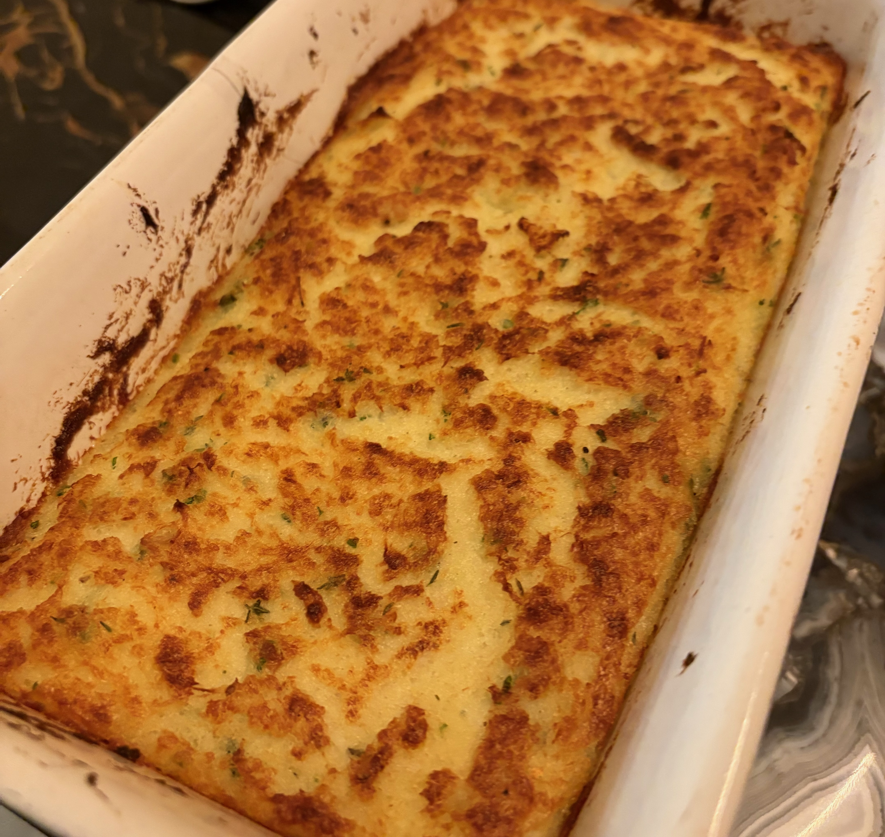

# Brandade de Morue

### Pour 4 personnes

- 1kg Morue séchée salée
- 500g Pommes de terre
- ~30cL Huile d'olive
- ~15cL Lait
- 5 gousses d'Ail
- Thym

---

1. Désaler la morue à l'eau froide au moins **24h à l'avance**, changer l'eau au moins trois fois.
2. Cuire le morue au **court-bouillon 15min** avec l'ail, un bouquet de thym et quelques feuilles de laurier.
3. Cuire les pommes de terre **à l'eau 20min**.
4. Récupérer la morue et l'ail, détailler la morue en enlevant peau et arêtes.
5. Travailler longuement et fortement les miettes de morue en ajoutant l'huile et le lait à mesure
   (fourchette, cuillère, mixer plongeant).
6. Presser les pommes de terre en purée avec l'ail de la cuisson de la morue et de l'huile d'olive.
7. Mélanger le tout, ajouter éventuellement un peu de persil (facultatif, 1cc). Rectifier.
8. Passer **20min au four à 200°**, poser un peu de beurre sur le dessus pour griller.
9. Passer à la salamndre pour griller la surface si nécessaire.
