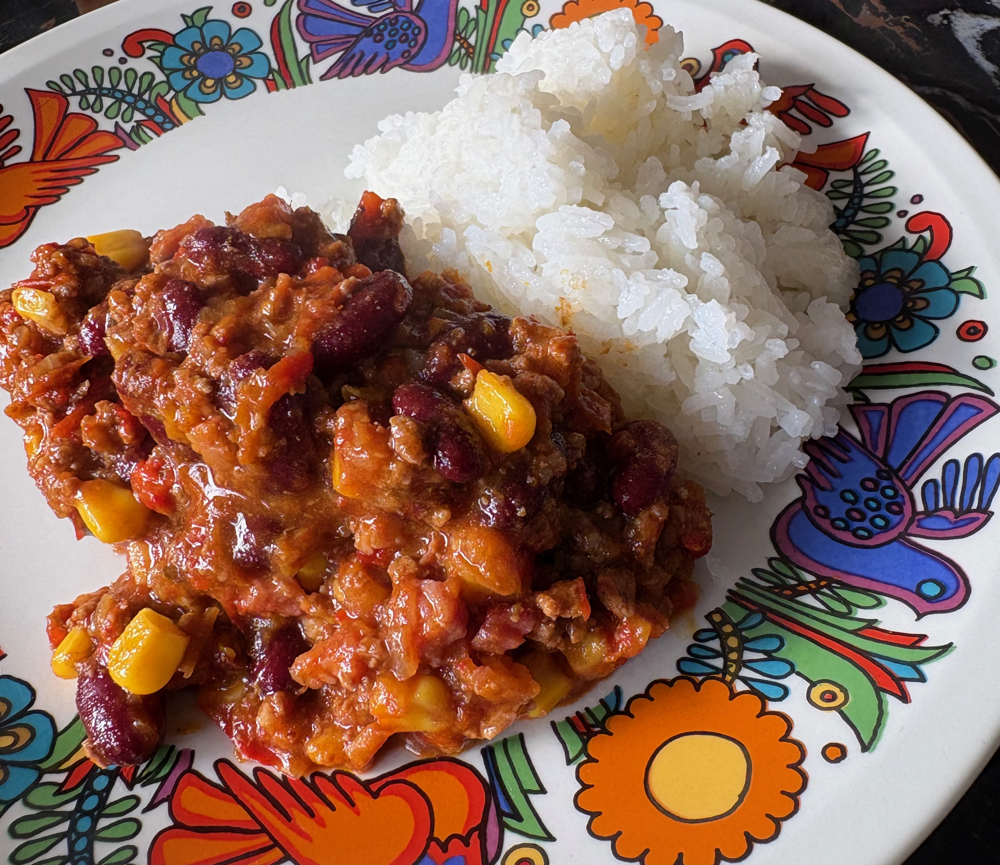

# Chili con Carne

### Pour 4 personnes

- 300g Bœuf haché
- 100g Poitrine de Porc fumée, détaillée en très petits lardons
- 2 Ognons
- 2 gousses d'Ail
- 2 Poivrons (rouges ou jaunes)
- 20cL Purée de Tomates (ou 2 tomates fraîches épépinées et émincées)
- 150g Haricots cuits (rouges ou noirs)
- 2 cS Maïs cuit (facultatif, en boîte)
- 2 cc Parpika
- 2 cc Origan
- ½ de Piment (ou plus, au goût)

---

1. Faire venir les ognons et les poivrons émincés dans une sauteuse, dans de l'huile (d'olive ou, mieux, de palme).
2. Ajouter et saisir la viande hachée, déglacer au Vermouth.
3. Ajouter l'ail haché, les épices, puis la purée de tomates. Laisser mijoter à couvert 15min.
4. Ôter le couvercle, laisser réduire, ajouter les haricots (et le maïs si l'on en met).
5. Rectifier. Servir avec du riz blanc.
