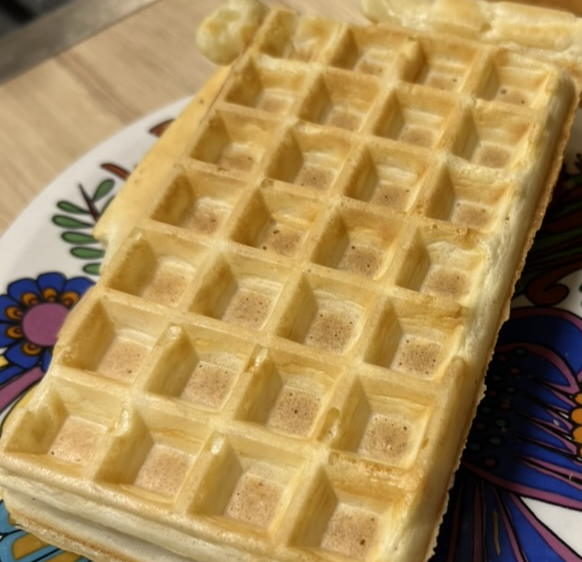

# Gaufres de Bruxelles

### Pour 15-16 gaufres

- 500g Farine
- 1 sachet Levure boulangère (ou 40g de levain)
- 2 cc Sucre
- 2 Œufs
- 75g Beurre
- 75cL de mélange lait/eau tiède tant pout tant
- 1 pincée de sel

---

1. Activer la levure dans un bol avec un peu du mélange eau/lait et le sucre.
2. Séparer les blancs des jaunes d’œufs.
3. Faites fondre le beurre, mélanger avec la farine et le mélange lait/eau. Fouetter pour éviter les grumeaux, ajouter la levure.
4. **Laisser pousser 1h**.
5. Monter les blancs en neige et les ajouter au mélange.
6. Cuire les gaufres au [gaufrier](https://frifri-shop.fr).
