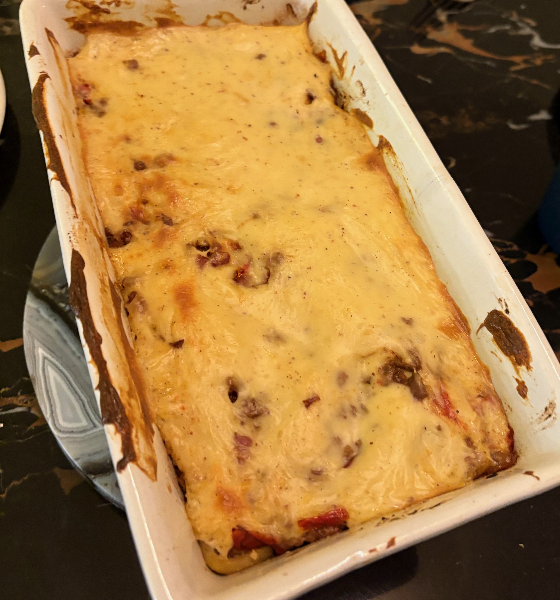

# Moussaka

[Source](https://www.ricardocuisine.com/recettes/9352-moussaka-classique-la-meilleure)

### Pour 4 personnes

- 2 Pommes de terre
- 2 Aubergines
- 1 Oignon
- 2 gousses d'ail
- 300g Bœuf haché
- 100g Poitrine de porc fumée
- 25cL Purée de tomates
- 50cL Lait
- Poivre, cannelle, paprika, origan

---

1. Trancher les PdT à la mandoline (2mm) et les aubergines au couteau (1cm), les badigeonner d'huile d'olive et les cuire au four **15min à 210°.**
2. Faire revenir l'oignon émincé, la viande, l'ail pressé dans une sauteuse avec de l'huile d'olive. Déglacer au vermouth. Ajouter la purée de tomates et les épices, laisser mijoter 10min.
3. Faire une [Béchamel](bechamel.md) à la grecque (avec un jaune d'œuf), ajouter sel, poivre, muscade au goût.
4. Monter la moussaka dans un plat huilé: PdT → aubergines → viande → béchamel. Mettre au four **15min à 180°.**
