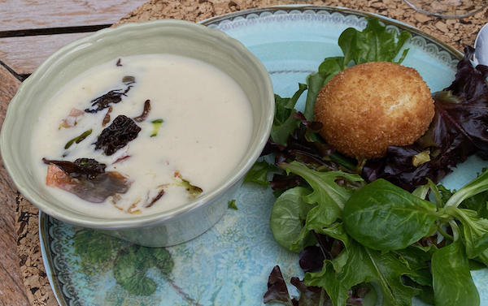

# Œuf frit, velouté de champignons

### Pour 4 personnes

- 800g Champignons (au choix: paris, pleurottes, girolles, cèpes)
- 5cL Vermouth blanc
- 3 Échalotes
- 50cL Crème liquide
- 20cL Bouillon de volaille
- 4 gousses d'Ail noir
- 5 Œufs
- Farine, Panko

---

1. Faire 4 œufs mollet ferme (5min 30), les paner (5e œuf) puis les réfrigérer
2. Saisir les champignons, ajouter les échalotes, déglacer au Vermouth
3. Ajouter le bouillon et la crème et laisser réduire de moitié
4. Mixer, passer au chinois, ajouter l'ail noir et mixer à nouveau. Rectifier.
5. Repasser les œufs dans la chapelure avant de les faire frire dans l'huile (170°)
6. Égoutter les œufs sur du papier absorbant, puis dresser